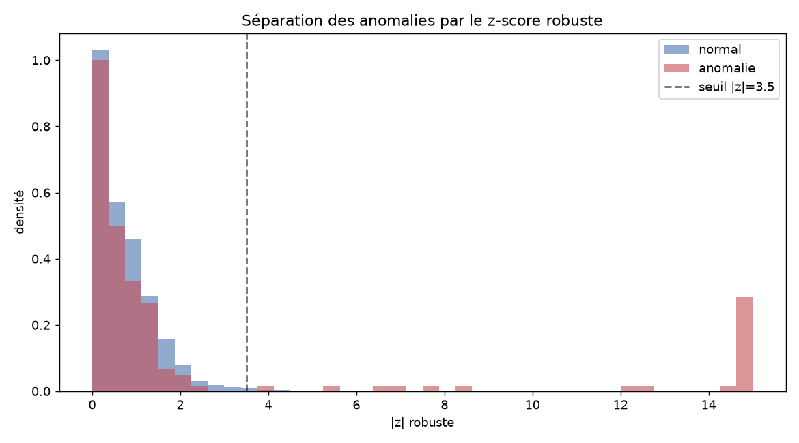
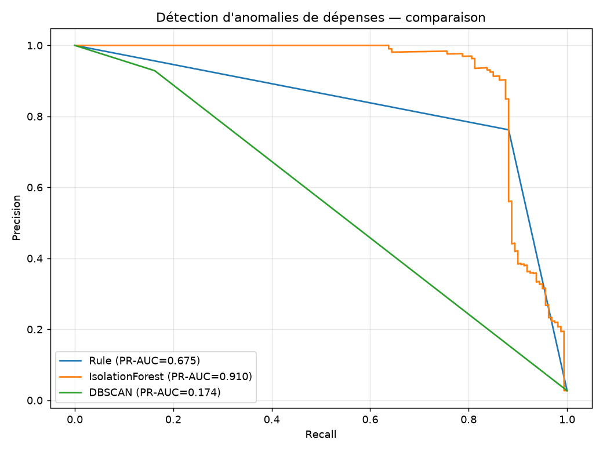

# Assistant budgétaire intelligent & détection d'anomalies de dépenses

Aider un particulier à **catégoriser automatiquement** ses dépenses, à
**comprendre** son comportement de consommation normal et à être **alerté** en
cas de dépense inhabituelle — de façon transparente, personnalisée et
explicable.

---

## 1. Problème & angle décisionnel

Un relevé bancaire est une liste de libellés cryptiques. L'utilisateur veut
trois choses : savoir **dans quelle catégorie** va chaque dépense, connaître
son **budget normal** par poste, et recevoir une **alerte** quand quelque chose
cloche (débit en double, achat anormalement élevé, rafale de prélèvements). Ce
projet livre les trois briques, évaluées honnêtement.

## 2. Données

Aucun jeu ouvert ne combine à la fois des **libellés marchands réalistes**, des
**habitudes par utilisateur**, de la **saisonnalité** et des **anomalies
étiquetées**. On **génère** donc un jeu synthétique documenté (`src/generate.py`,
Faker + règles), avec **vérité terrain** (`category`, `is_anomaly`,
`anomaly_type`) permettant d'évaluer chaque module.

- **8 utilisateurs**, 18 mois, **~5 900 transactions**, ~2,7 % d'anomalies.
- Dépenses **récurrentes** (loyer, abonnements, énergie) à dates/montants
  stables + dépenses **variables** avec rythme hebdomadaire et effets
  saisonniers (chauffage l'hiver, voyages l'été, achats en décembre).
- Libellés bruités (« CB CARREFOUR », « UBER EATS 08 », « MCDONALDS SAINTE
  CORINNE ») → vraie difficulté NLP.
- **4 types d'anomalies** injectées : pic de montant, achat hors habitude,
  débit en double, rafale de débits.
- *Prêt pour du réel* : le code accepte un vrai jeu type *Daily Household
  Transactions* (Kaggle) en remplaçant `load_raw()`.

## 3. Méthodologie

| Étape | Module | Contenu |
|---|---|---|
| Génération | `src/generate.py` | Transactions réalistes + anomalies étiquetées |
| Catégorisation | `src/categorize.py` | **TF-IDF char n-grammes + SVM** vs règles mots-clés |
| Comportement | `src/behavior.py` | Base robuste médiane/MAD glissante **causale** + z-score robuste |
| Détection | `src/anomaly.py` | Features multivariées + **Isolation Forest** vs DBSCAN vs règle |
| Recommandation | `src/recommend.py` | Budgets robustes par catégorie, projection fin de mois, flux d'alertes |

Techniques mobilisées (au-delà des deux requises) : **NLP supervisé**,
**modélisation de séries temporelles** (base glissante), **détection d'anomalies
non supervisée**.

## 4. Résultats clés

### Catégorisation (test tenu à l'écart)

| Méthode | Macro-F1 | Couverture |
|---|---|---|
| Règles mots-clés | 0,98 | 100 %* |
| **TF-IDF + SVM** | ~1,00 | 100 % |

*Le TF-IDF généralise à des libellés **inédits** (« SNCF CONNECT » → Transport).
Le score très élevé reflète un vocabulaire de marchands partagé — la
généralisation aux libellés nouveaux est le vrai test (voir limites).

### Détection d'anomalies (vs vérité terrain, ~3 % de positifs)

| Détecteur | PR-AUC | Précision | Rappel |
|---|---|---|---|
| **Isolation Forest** | **0,91** | 0,90 | 0,88 |
| Règle (z \| doublon \| rafale) | 0,68 | 0,76 | 0,88 |
| DBSCAN (bruit) | 0,17 | 0,93 | 0,16 |

**Rappel par type (Isolation Forest)** : rafales **100 %**, pics de montant
78 %, achats hors habitude 71 %, doublons **54 %** (les plus discrets — montant
normal, seul le timing trahit). Enseignement clé : un z-score sur le montant ne
suffit pas, il faut des features de **fréquence/duplication**.

### Recommandations
Budgets robustes par (utilisateur, catégorie), projection fin de mois signalant
les dépassements, et flux d'alertes typé et lisible (« Débit en double
probable », « Achat hors habitude »…).

| | |
|---|---|
|  |  |

## 5. Limites & éthique

- **Données synthétiques** — les performances (surtout la catégorisation
  quasi-parfaite) seraient plus basses sur de vraies données bancaires, plus
  bruitées et ambiguës. Les patterns reflètent nos règles de génération.
- **Vie privée** — données financières sensibles : consentement, minimisation,
  traitement local/chiffré indispensables en usage réel.
- **Faux positifs** — une alerte injustifiée érode la confiance ; seuil réglable
  par l'utilisateur et alertes explicables (flux typé).
- **Démarrage à froid** — un nouvel utilisateur sans historique ne peut être
  profilé : prévoir des budgets par défaut.

## 6. Reproduction

```bash
conda create -n budget python=3.11 -y && conda activate budget
pip install -r requirements.txt

python src/generate.py     # génère les transactions (vérité terrain incluse)
python src/categorize.py   # catégorisation NLP
python src/behavior.py     # profil comportemental + z-score robuste
python src/anomaly.py      # détection d'anomalies comparée
python src/recommend.py    # budgets + projection + alertes
python notebooks/build_notebook.py
```

`random_state=42` partout ; toutes les sorties sont régénérées dans `reports/`.

## 7. Structure du repo

```
05-smart-budget-anomaly/
├── data/raw/transactions.csv     # données synthétiques (~1 Mo, versionnées)
├── notebooks/
│   ├── 05_smart_budget.ipynb
│   └── build_notebook.py
├── src/
│   ├── generate.py    categorize.py   behavior.py
│   ├── anomaly.py     recommend.py
├── reports/
│   ├── figures/        # PNG (trajectoires, séparation z, PR, budget)
│   └── *.csv           # comparatifs, budgets, flux d'alertes
├── README.md
└── requirements.txt
```
